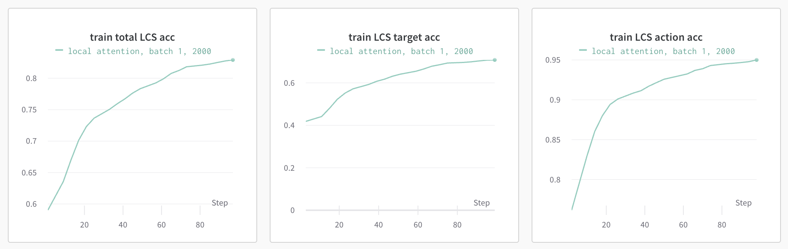

# Introduction
This repository implements a Vanila & Attention Encoder Decoder to learn ALFRED (Action Learning From Realistic Environments and Directives) dataset. This dataset contains a set of instructions given to a human to achieve a specific task such as grapping a cup or finding a mat. It also includes for each instruction the target object like (mat, cup, knife .. etc) and the action done (gotolocation, putobject .. etc).

# Implementation

- Vanila Encoder Decoder

        Encoder(
         (embedding): Embedding(1000, 300)
         (lstm): LSTM(300, 256, batch_first=True, dropout=0.33)
        )
        Decoder(
         (embedding_action): Embedding(11, 300, padding_idx=0)
         (embedding_target): Embedding(83, 300, padding_idx=0)
         (lstm): LSTM(300, 256, batch_first=True)
         (fc_action): Linear(in_features=256, out_features=11, bias=True)
         (fc_target): Linear(in_features=256, out_features=83, bias=True)
        )   

- Encoder Decoder with Global & Local Attention & Glove

        Encoder(
         (embedding): Embedding(1000, 300)
         (lstm): LSTM(300, 256, batch_first=True, dropout=0.33)
        )
        AttentionDecoder(
         (embedding_action): Embedding(11, 256, padding_idx=0)
         (embedding_target): Embedding(83, 256, padding_idx=0)
         (lstm): LSTM(256, 256, batch_first=True)
         (dropout): Dropout(p=0.33, inplace=False)
         (a): Linear(in_features=512, out_features=1, bias=True)
         (fc_action): Linear(in_features=256, out_features=11, bias=True)
         (fc_target): Linear(in_features=256, out_features=83, bias=True)
        )

# Discussion

- The vanilla encoder decoder didn't perform very well in terms of accuracy. The accuracy didn't pass 0.03 for both validation and training set. 

    Running: `train.py`

- The vanilla encoder decoder with global attention performed much worse than the vanilla because of the long instruction sequence which made the attention learning more difficult. As in the below plots the accuracy didn't exceed 0.008 which is much lower than the vanilla one. I used `pack_padded_sequence` so it packs up the input to the maximum sequence in the input. One thing that I noticed, when training with a batch greater than one the performance degrades alot because of the extra padding in the different episodes than the maximum packed one which made learning the attention on the input sequence more difficult.

    Running: `train.py --attention`

- (BONUS) To mitiagte the previous issue I used local attention with a window of 2 right & left which made a huge jump in performance as in the below plots. The accuracy has passed 0.8 for training and was around 0.58 for validation which is much better than the previous models. A better approach to consider is to attend the whole instructions of the decoding step.

    Running: `train.py --attention --local_attention`

- (BONUS) To see how word embeddings can contribute to downstream tasks I used GLoVE as a word embedding and freezed it's learning, I didn't notice a learning gain than the pervious model.

    Running: `train.py --attention --local_attention --glove`

- I implemented the Transformer Encoder Decoder but didn't have time to compare to run it and compare it with the attention encoder decoder